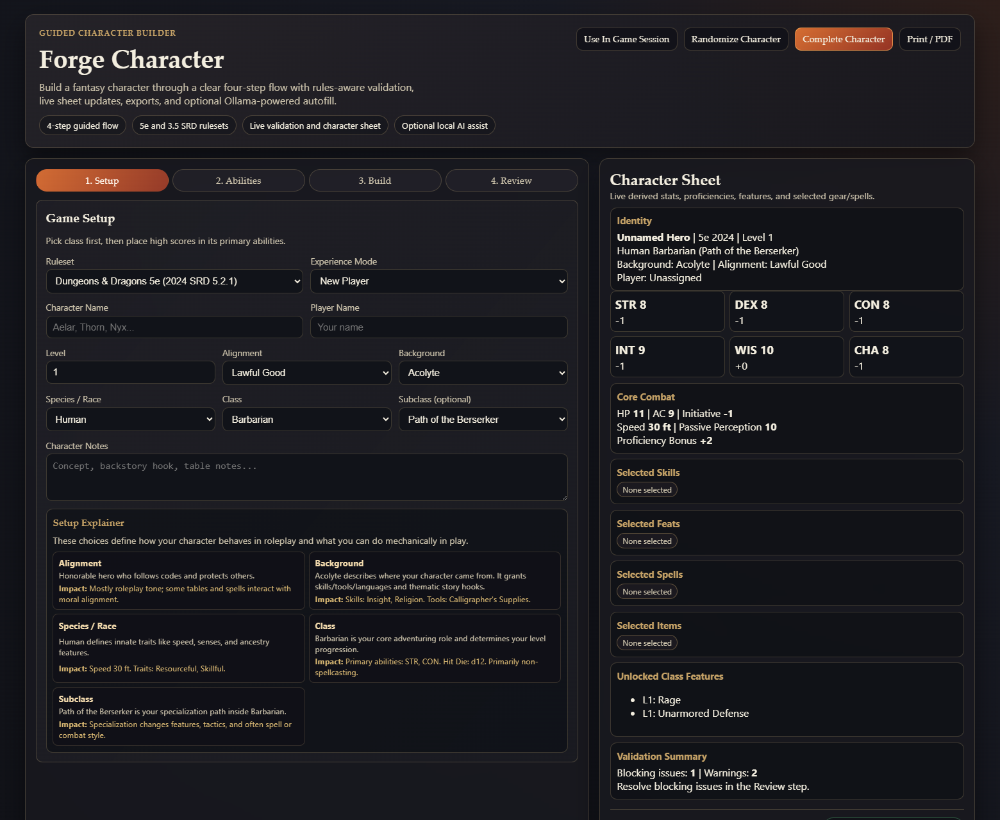
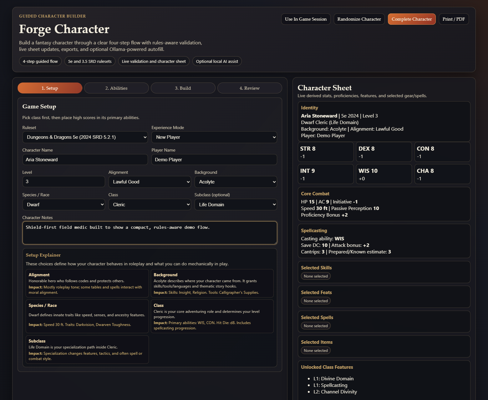
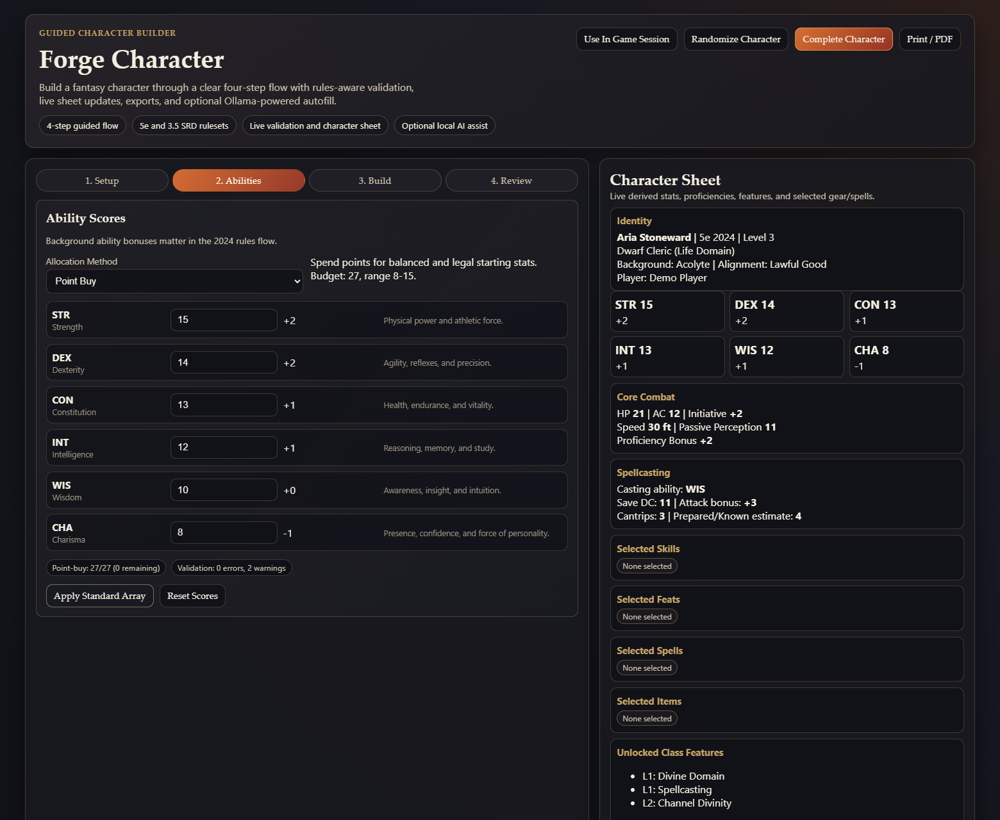
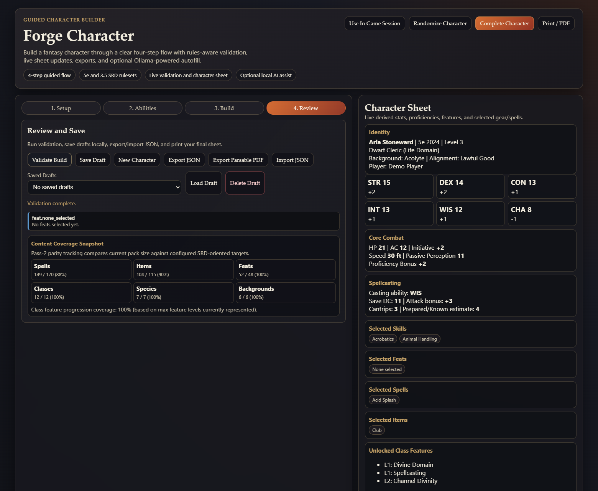

# Forge Character

Guided tabletop RPG character builder focused on making rules-heavy character creation easier to learn, faster to complete, and easier to review.



## What This Product Does

Forge Character turns fantasy character creation into a bounded workflow instead of a giant spreadsheet of options. The fastest entry point is the root builder at `index.html`: a guided four-step experience for choosing a ruleset, shaping a character concept, allocating abilities, making build choices, and reviewing a final sheet with validation, saves, and exports.

The repo also includes a typed React + Fastify monorepo that extends the product with a shared rules package, DM session workflows, revision history, and an optional Ollama-backed draft assistant.

## Why This Is Interesting

Character builders are deceptively hard product problems. They combine multi-step state, edition-specific rules, progression logic, validation, and a UX challenge: how do you reduce friction for players without hiding too much of the rules?

This project is interesting because it treats character creation as a workflow design problem, not just a form. The product balances flexibility with guardrails, gives clear progression through the build, and keeps the current character state visible through a live sheet and validation feedback.

## Who It Is For

- Players who want a clearer path through fantasy character creation
- Game masters who need quick, reviewable character builds
- Teams evaluating product thinking, workflow design, and practical front-end/back-end execution

## Why It Stands Out

- Guided step-by-step flow instead of a single overwhelming canvas
- Multiple SRD-oriented rulesets, including 5e and 3.5e coverage
- Live derived stats, validation feedback, and export-ready output
- Optional local AI assist that can fill fields from free text without becoming the core story
- A public repo that shows both product polish and technical depth

## 60-Second Demo Path

1. Open the root builder.
2. Choose a ruleset and give the character a name, class, and species.
3. Move to ability scores and show the live validation and point-buy feedback.
4. Pick a few skills, spells, or items.
5. Finish on Review to show the live character sheet, validation state, local save/export, and optional AI autofill.

The exact spoken version is in [docs/DEMO-SCRIPT.md](docs/DEMO-SCRIPT.md).

## Workflow At A Glance








## Core Features

- Guided four-step builder for setup, abilities, build choices, and review
- SRD-oriented ruleset support for 5e 2024, 5e 2014, and 3.5e content packs
- Live sheet rendering with derived stats, features, gear, and spell selections
- Rules-aware validation and progression feedback during the build
- Local save/load plus JSON import/export and parsable PDF export
- Optional Ollama-powered chat assist that can translate free text into builder fields
- React/API monorepo path for shared contracts, session publishing, and revisions

## Rules, Architecture, And State Management

The public demo path is intentionally simple: the root builder is a direct-file, low-friction entry point that works well for quick demos and local use.

Under the hood, the repo also shows a more modular architecture:

- `src/`: direct-file builder shell, legacy engine, and `file://`-safe bundle
- `apps/web`: React builder and DM session workspace
- `apps/api`: Fastify API for characters, sessions, revisions, and AI assist
- `packages/rules-core`: typed rules contracts, validation, export, and AI-assist payloads
- `packages/ui`: reusable React UI primitives and styles

This split lets the repo show both workflow-first product design and a realistic path toward a more typed, service-backed application architecture.

## Tech Stack

- TypeScript and modern JavaScript
- React 19 + Vite for the web app
- Fastify for the API
- Prisma-ready persistence with in-memory fallback
- Vitest for tests
- Esbuild for the direct-file bundle
- Ollama for optional local AI assist

## Run Locally

Requirements:

- Node.js `20.19+` or `22.12+`
- Windows PowerShell with `npm.cmd`, or macOS Tahoe 26 with Terminal

Recommended launch on Windows:

```bash
./START_FORGE_CHARACTER_AI.cmd
```

Recommended launch on macOS:

```bash
./START_FORGE_CHARACTER_MAC.command
```

The one-click launchers check Node/npm, create `.env` from `.env.example` if needed, install stale or missing npm dependencies, rebuild shared packages, regenerate the `file://` static bundle, start the API and React dev app, probe `/health` and `/ready`, check Ollama/model availability for optional AI autofill, write logs under `logs/`, then open `index.html`.

PowerShell-safe Windows alternative:

```bash
npm.cmd run start:ai
```

macOS Terminal alternative:

```bash
npm run start:ai:mac
```

If macOS blocks a downloaded `.command` file, run these once from the repo folder:

```bash
chmod +x START_FORGE_CHARACTER_MAC.command start-forge-character-mac.sh
xattr -dr com.apple.quarantine .
```

Manual dependency install if you are not using a launcher:

```bash
npm install
```

Manual split-mode commands:

```bash
npm run dev
npm run dev:web
npm run dev:api
```

Primary local paths:

- Root builder: `index.html`
- Optional diagnostics launcher: `launcher.html`
- React app: `http://localhost:5173`
- API health: `http://localhost:8787/health`

If you edit the root builder source, refresh the checked-in `file://` bundle:

```bash
npm run bundle:static
```

## Sample And Demo Content

Fastest demo options:

- Click `Randomize Character` for a working example immediately
- Build a simple character manually in the root flow
- Use the chat prompt: `Make me a level 3 dwarven cleric named Aria`

The API defaults to in-memory storage, so no database setup is required for a demo. If you want Prisma-backed storage, copy [`.env.example`](.env.example) and provide a local PostgreSQL `DATABASE_URL`.

## Product Decisions And Tradeoffs

- The root builder stays lightweight and demo-friendly, even though the repo also contains a fuller React/API architecture.
- AI is optional and local-first. If Ollama is unavailable, the product still works and the chat falls back to deterministic guidance.
- The repo is intentionally SRD-oriented. It avoids pretending to be a complete commercial rules catalog.
- The guided flow prioritizes clarity over maximal on-screen density.

## Roadmap

- Tighten content-pack coverage and onboarding copy
- Expand the strongest session-sharing flows from the React/API stack
- Improve screenshot/demo automation for repeatable portfolio updates
- Continue unifying more behavior around shared typed rules contracts

## Supporting Docs

- [Case study](docs/CASE-STUDY.md)
- [60-second demo script](docs/DEMO-SCRIPT.md)
- [Resume, LinkedIn, and interview bullets](docs/RESUME-BULLETS.md)
- [Publish checklist and GitHub metadata](docs/publish-steps.md)
- [Mac setup and one-click launcher notes](docs/MAC-SETUP.md)

## Content Scope

This repo is SRD-oriented. The included rulesets reference SRD-era material and surface license notices in-app. If you extend the project with non-SRD content, review the legal scope before publishing those additions.
